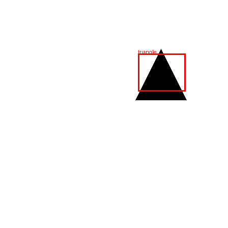

# Yolov1 Toying project
Simple project to test Yolov1 on synthesized dataset.
## Steps
### 1. Create shapes of rectangles and circles (2 classes)
Data will be generated as follows: `data/images/*.jpg` and `data/labels/*.txt`
```bash
python scripts/gen_synth_dataset.py
```

### 2. Training model
```bash
python train.py
```
This will generate `yolov1tiny.pth` model file for you

### 3. Inference
```bash
python test.py
```
This will generate `predicted.png` output file of detection result. \
**Notice:** change this line `test_img, _ = dataset[7]` index to use a different image.\

## Example result

